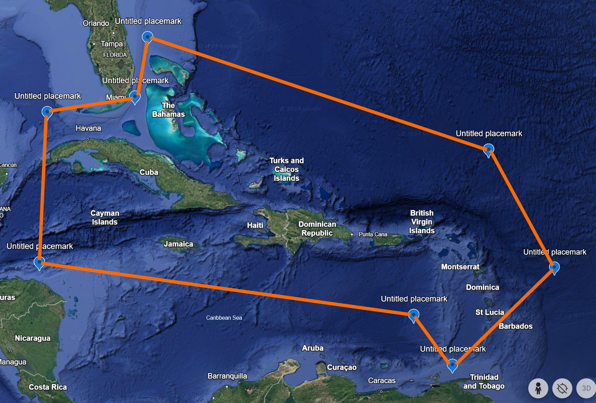

## Introduction
A species-area relationship (SAR) visualizes the relationship between species richness (the number of species) and the area of the land mass on which the species live. The observation that species richness increases with increasing area is a fundamental law of ecology, and a disruption in this relationship may be associated with habitat loss, habitat fragmentation, and increasing numbers of non-native species. Creating SARs for island-dwelling species helps researchers understand how trends in biodiversity across archipelagos are changing due to these effects.

The goal of this vignette is to use the *SSARP* R package to create a SAR for *Anolis*, a well-studied genus of lizards. We will focus on *Anolis* occurrence records from the Caribbean Islands. More information about the *SSARP* package and a comparison to a previously published SAR for *Anolis* can be found [in the manuscript associated with the package](https://www.biorxiv.org/content/10.1101/2024.12.31.630948v1).

In order to construct a species-area relationship with *SSARP*, we will:

* Gather occurrence data from GBIF
* Filter out invalid occurrence records 
* Find areas of pertinent land masses
* Create a species-area relationship

## Gathering Occurrence Data
GBIF (Global Biodiversity Information Facility) provides an easy method for gathering occurrence data for taxa of interest. *SSARP* uses functions from the *rgbif* package to gather occurrence records associated with a given taxon. The user may also provide their own data for use in creating a SAR, but we will use GBIF in this example.

In order to access data from GBIF, we must first determine the unique identifying key associated with the taxon of interest. We will use the "getKey" function from *SSARP* to obtain this key.


``` r
library(SSARP)

# Get the GBIF key for the Anolis genus
key <- getKey(query = "Anolis", rank = "genus")
```

Now that we have the key associated with *Anolis*, we will use this key with *SSARP*'s "getData" function to gather georeferenced occurrence records from GBIF. The “limit” parameter will be set to 10000 in this case for a quick illustration of *SSARP*’s functionality, but this parameter can be as large as 100,000 (the hard limit from *rgbif* for the number of records returned).

We are only interested in occurrence records for island-dwelling anole lizards located in the Caribbean, so we will geographically restrict the returned data to this area by setting the “geometry” parameter to a polygon in Well Known Text (WKT) format that encompasses the Caribbean islands (Figure 1).




``` r
# Get data for Anolis from GBIF in the specified polygon
dat <- SSARP::getData(key = key, limit = 10000, geometry = 'POLYGON((-84.8 23.9, -84.7 16.4, -65.2 13.9, -63.1 11.0, -56.9 15.5, -60.5 21.9, -79.3 27.8, -79.8 24.8, -84.8 23.9))')
```

## Finding Land Mass Names and Areas
Once the occurrence data is returned, we will use each occurrence record’s GPS point to determine the land mass on which the species was found and find the area associated with that land mass using a database of island areas and names from *SSARP*.


``` r
# Find land mass names
land_dat <- findLand(occurrences = dat)

# Use the land mass names to get their areas
area_dat <- findAreas(occs = land_dat)
```
The “removeContinents” function in *SSARP* removes any continental occurrence records, which is useful when the user is only interested in island-dwelling species (as we are in this example). While the data obtained by using the “getData” function was geographically restricted, potential user error in specifying the polygon in WKT format often leads to accidental continental records that will be removed by using this function.


``` r
nocont_dat <- removeContinents(occs = area_dat)
```

## Create Species-Area Relationship
Next, we will generate the SAR using the “SARP” function. The “SARP” function creates multiple regression objects with breakpoints up to the user-specified “npsi” parameter. For example, if “npsi” is two, “SARP” will generate regression objects with zero (linear regression), one, and two breakpoints. The function will then return the regression object with the lowest AIC score. The “npsi” parameter will be set to one in this example. Note that if linear regression (zero breakpoints) is better-supported than segmented regression with one breakpoint, the linear regression will be returned instead.


``` r
SARP(occurrences = nocont_dat, npsi = 1)
```


```
## 
## 	***Regression Model with Segmented Relationship(s)***
## 
## Call: 
## segmented.lm(obj = linear, seg.Z = ~x, npsi = 1, control = seg.control(display = FALSE))
## 
## Estimated Break-Point(s):
##           Est. St.Err
## psi1.x 21.982  0.723
## 
## Coefficients of the linear terms:
##             Estimate Std. Error t value Pr(>|t|)
## (Intercept) -0.84251    1.00776  -0.836    0.409
## x            0.08500    0.05405   1.573    0.125
## U1.x         0.71424    0.21612   3.305       NA
## 
## Residual standard error: 0.5664 on 34 degrees of freedom
## Multiple R-Squared: 0.6441,  Adjusted R-squared: 0.6127 
## 
## Boot restarting based on 8 samples. Last fit:
## Convergence attained in 2 iterations (rel. change 3.648e-10)
```

This is the SAR for *Anolis* including island-based occurrences within a polygon around Caribbean islands from the first 10000 records for the genus in GBIF! The best-fit model was a segmented regression with one breakpoint.
