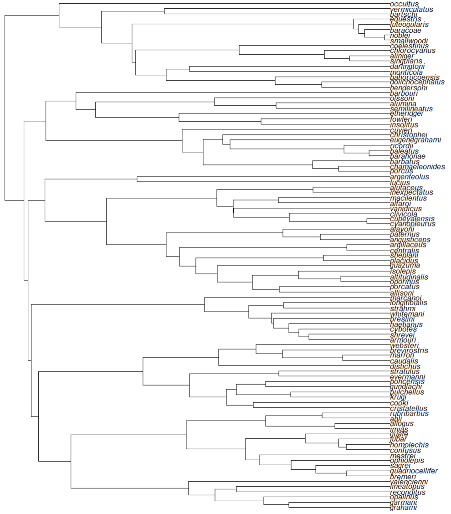
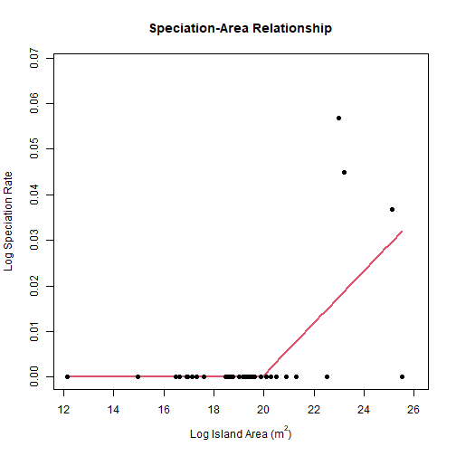
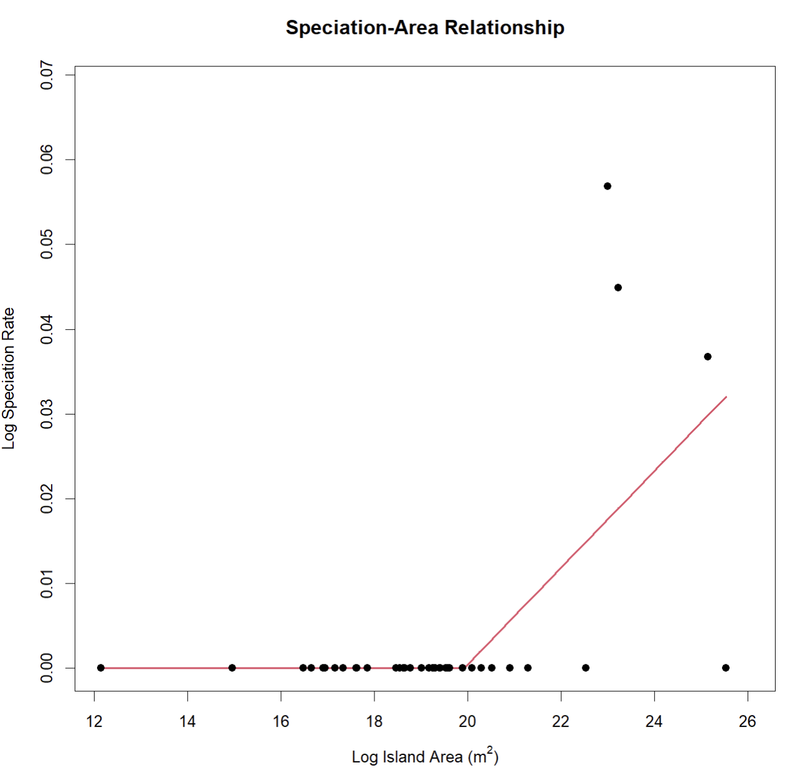

## Introduction

A speciation-area relationship (SpAR) plots speciation rates against the area of the island on which the associated species live. This vignette, which covers how to create a SpAR using the *SSARP* package, uses knowledge and data generated from [the vignette describing the creation of species-area relationships](https://kmartinet.github.io/SSARP/articles/Create_SAR.html). Code relevant to generating the necessary data for this SpAR example from the species-area relationship (SAR) vignette will be included here, but the reader is encouraged to read [the SAR vignette](https://kmartinet.github.io/SSARP/articles/Create_SAR.html) for additional details.

In this vignette, we will create a SpAR for the lizard genus *Anolis*, as a continuation of the SAR vignette.

## Generate Occurrence Data
First, we will generate the "nocont_dat" object from the SAR vignette, which includes occurrence records and their associated island names and areas for *Anolis* lizards that live on Caribbean islands.


``` r
library(SSARP)

# Get the GBIF key for the Anolis genus
key <- getKey(query = "Anolis", rank = "genus")

# Get data for Anolis from GBIF from islands in the Caribbean
dat <- SSARP::getData(key = key, limit = 10000, geometry = 'POLYGON((-84.8 23.9, -84.7 16.4, -65.2 13.9, -63.1 11.0, -56.9 15.5, -60.5 21.9, -79.3 27.8, -79.8 24.8, -84.8 23.9))')

# Find land mass names
land_dat <- findLand(occurrences = dat)

# Use the land mass names to get their areas
area_dat <- findAreas(occs = land_dat)

# Remove continents from the filtered occurrence record dataset
nocont_dat <- removeContinents(occs = area_dat)
```


## Calculate Speciation Rates
The “nocont_dat” object created above can be used with a phylogenetic tree to create a SpAR. This step in the *SSARP* workflow enables the user to determine whether the breakpoint in the SAR corresponds with a threshold for island size at which in situ speciation occurs (see Losos and Schluter 2000). 

The phylogenetic tree for *Anolis* that we will use in this example is a trimmed version of the tree used by Patton et al. (2021). This trimmed tree only includes anoles found on islands in the Caribbean. In order to read the tree, we must use the *ape* R package.


``` r
library(ape)
tree <- read.tree(file = "Patton_Anolis_Trimmed.tree")
```


Now that we have a phylogenetic tree, we can estimate tip speciation rates for use in our speciation-area relationship. *SSARP* includes three methods for estimating tip speciation rates: BAMM (Rabosky 2014), the lambda calculation for crown groups from Magallόn and Sanderson (2001), and DR (Jetz et al. 2012). In this example, we will use the lambda calculation for crown groups from Magallόn and Sanderson (2001) through the "speciationMS" function in *SSARP*. The "label_type" parameter in this function tells *SSARP* whether the tip labels on the given tree include the full species name (binomial) or just the specific epithet (epithet).


``` r
# Calculate tip speciation rates using the lambda calculation for crown groups from Magallόn and Sanderson (2001)
speciation_occurrences <- speciationMS(tree = tree, label_type = "epithet", occurrences = nocont_dat)
```

The “speciation_occurrences” object is a dataframe containing island areas with their corresponding speciation rate as estimated by the “speciationMS” function.

## Create Speciation-Area Relationship
Next, we will use the “speciation_occurrences” object with the “SpeARP” function to create a SpAR. Just like the “SARP” function, the "SpeARP" function creates multiple regression objects with breakpoints up to the user-specified “npsi” parameter. For example, if “npsi” is two, “SpeARP” will generate regression objects with zero (linear regression), one, and two breakpoints. The function will then return the regression object with the lowest AIC score. The “npsi” parameter will be set to one in this example. Note that if linear regression (zero breakpoints) is better-supported than segmented regression with one breakpoint, the linear regression will be returned instead.

The final parameter is the “MS” parameter, which tells *SSARP* whether the user generated speciation rate estimates using the “speciationMS” function (TRUE) or not (FALSE). This is an important parameter because if “speciationMS” is used, the speciation rate calculation already log-transforms the values. The other speciation rate estimation methods do not automatically log-transform the speciation rate values.


``` r
SpeARP(occurrences = speciation_occurrences, npsi = 1, MS = TRUE)
```



```
## 
## 	***Regression Model with Segmented Relationship(s)***
## 
## Call: 
## segmented.lm(obj = linear, seg.Z = ~x, npsi = 1, control = seg.control(display = FALSE))
## 
## Estimated Break-Point(s):
##           Est. St.Err
## psi1.x 19.924  1.002
## 
## Coefficients of the linear terms:
##               Estimate Std. Error t value Pr(>|t|)
## (Intercept)  2.058e-11  2.158e-02    0.00        1
## x           -1.244e-12  1.188e-03    0.00        1
## U1.x         5.712e-03  2.085e-03    2.74       NA
## 
## Residual standard error: 0.01037 on 34 degrees of freedom
## Multiple R-Squared: 0.3996,  Adjusted R-squared: 0.3466 
## 
## Boot restarting based on 6 samples. Last fit:
## Convergence attained in 3 iterations (rel. change 2.3011e-16)
```



You will notice that two of the largest islands have a speciation rate of zero in this example. This very likely occurred because the calculation for speciation rate in Magallόn and Sanderson (2001) that “speciationMS” uses is based on monophyly, which can be disrupted on islands with non-native species occurrence records. When using the "speciationMS" function to estimate speciation rates for a SpAR, it is incredibly important to manually filter the returned occurrence records to remove non-native species.


### Literature Cited

* Jetz, W., Thomas, G.H., Joy, J.B., Hartmann, K., & Mooers, A.O. (2012). The global diversity of birds in space and time. Nature, 491: 444-448.
* Losos, J.B. & Schluter, D. (2000). Analysis of an evolutionary species-area relationship. Nature, 408: 847-850.
* Magallόn, S. & Sanderson, M.J. (2001). Absolute Diversification Rates in Angiosperm Clades. Evolution, 55(9): 1762-1780.
* Patton, A.H., Harmon, L.J., del Rosario Castañeda, M., Frank, H.K., Donihue, C.M., Herrel, A., & Losos, J.B. (2021). When adaptive radiations collide: Different evolutionary trajectories between and within island and mainland lizard clades. PNAS, 118(42): e2024451118.
* Rabosky, D.L. (2014). Automatic Detection of Key Innovations, Rate Shifts, and Diversity-Dependence on Phylogenetic Trees. PLOS ONE, 9(2): e89543.
