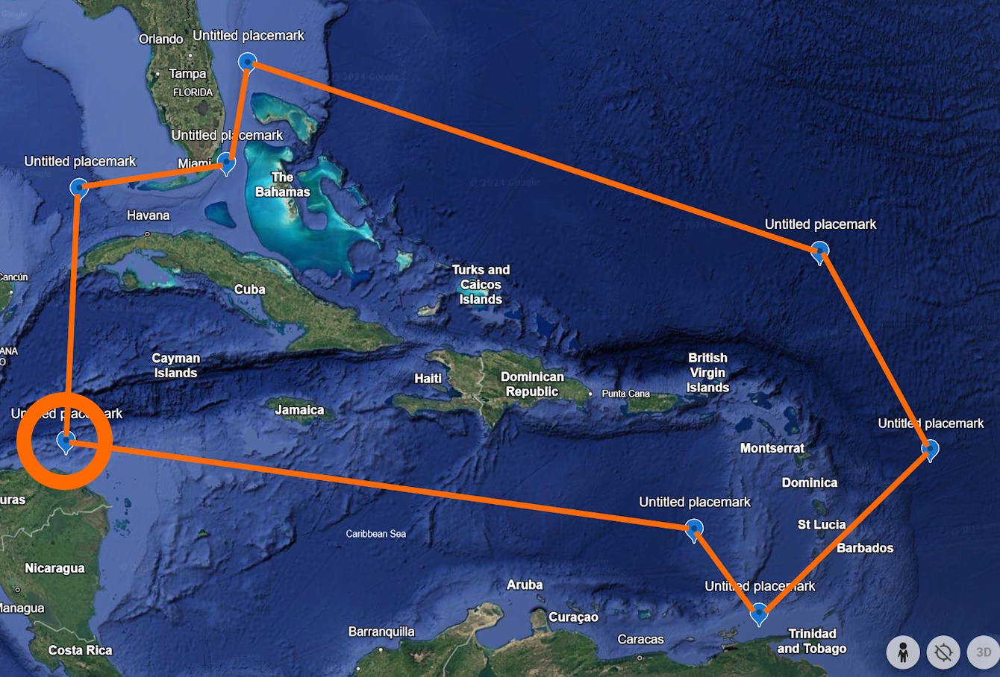
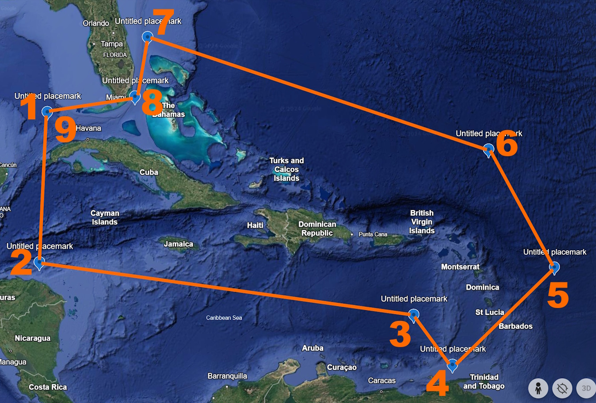

## Introduction
The *ssarp* R package has two main goals: create species-area relationships (SARs) when occurrence records are given as input, and create speciation-area reltionships (SpARs) when occurrence records and a phylogeny associated with the taxa of interest are given as input.

The observation that species richness increases with increasing area is a fundamental law of ecology, and a disruption in this relationship may be associated with habitat loss, habitat fragmentation, and increasing numbers of non-native species. Creating SARs for island-dwelling species helps researchers understand how trends in biodiversity across archipelagos are changing due to these effects.

Creating SpARs, which plot speciation rates against the area of the island on which the associated species live, for the same island-dwelling species allows researchers to further explore drivers of biodiversity across archipelagos.

The creation of both of these relationships requires occurrence records for the taxa of interest.

In this vignette, we will explore different options for gathering occurrence records using the *rgbif* package, which allows us to access data on GBIF (Global Biodiversity Information Facility) through the use of the GBIF API. These records can then be used in *ssarp*'s workflow to [create SARs](https://kmartinet.github.io/ssarp/articles/Create_SAR.html) and [create SpARs](https://kmartinet.github.io/ssarp/articles/Create_SpAR.html).

Here, we will discuss the following main topics:

* How to obtain a taxon key with `rgbif` for use in querying GBIF's database of occurrence records
* How to use `rgbif::occ_download()` to obtain occurrence records for the taxon of interest
* How to use `rgbif::occ_search()` to obtain occurrence records for the taxon of interest
* How to restrict occurrence records to a specific geographic range using WKT geometry with `rgbif::occ_download()` and `rgbif::occ_search()`

## Obtaining a Taxon Key
In order to access data from GBIF, we must first determine the unique identifying key associated with the taxon of interest. We will use the `rgbif::name_suggest()` function to find this key. To illustrate the use of `rgbif::occ_download()`, we will focus on the lizard species *Anolis allisoni*. 

Please note that creating a SAR or SpAR for one species is not informative. This example focuses on one species to reduce the time for downloading occurrence records.

```{r get_key, warning = FALSE}
library(rgbif)

# Taxon query
query <- "Anolis allisoni"
# Taxon rank
rank <- "Species"

rgbif::name_suggest(q = query, rank = rank)
```
The `rgbif::name_suggest()` function will return a tibble with taxa that closely match the query, along with their associated keys. The name in the first row is the best match that `rgbif::name_suggest()` found. The first row is the exact correct taxon, so we will use this key to download occurrence records from GBIF.

First, let's save the key as a variable for use in the call to download data.

```{r save_key}
# Re-run name_suggest() call to save table
suggestions <- rgbif::name_suggest(q = query, rank = rank)

# The correct key is the first element in the first row
key <- as.numeric(suggestions$data[1,1])

# Print key
key
```

## Downloading Occurrence Records Using occ_download()
Next, we can use `rgbif::occ_download()` or `rgbif::occ_search()` to gather occurrence records for the taxon of interest (*Anolis allisoni*). 

The `rgbif::occ_download()` function is much more robust than the `rgbif::occ_search()` function, as the `rgbif::occ_download()` function does not have a limit to the number of occurrence records returned, while the `rgbif::occ_search()` function does. In addition, the `rgbif::occ_download()` function creates a record of your downloaded dataset with an associated DOI for proper citation in your publications that utilize this data ([found in the Downloads tab on your GBIF User page](https://www.gbif.org/user/download)).

The `rgbif::occ_download()` function requires the user to have a GBIF account to use it, [so please follow the instructions here to set your GBIF username and password in your R environment](https://docs.ropensci.org/rgbif/articles/gbif_credentials.html) before continuing with this vignette.

Once your GBIF credentials are added to your .Renviron file, you can run `rbif::occ_download()` as written below. Please also reference [the official vignette associated with this function to learn more details](https://docs.ropensci.org/rgbif/articles/getting_occurrence_data.html).

The `rgbif::occ_download()` call includes the following elements:

* `pred("taxonKey", key)`: The taxon key for *Anolis allisoni* that we saved above.
* `pred("hasCoordinate"`, TRUE): Ensures that all returned records have an associated GPS coordinate.
* `pred("hasGeospatialIssue"`, FALSE): Ensures that none of the returned records have a known geospatial issue.
* `format = "DWCA"`: The most data-rich return format for the data. Contains information necessary for downstream *ssarp* functions.

```{}
download_key <- rgbif::occ_download(pred("taxonKey", key),
                                    pred("hasCoordinate", TRUE),
                                    pred("hasGeospatialIssue", FALSE),
                                    format = "DWCA")
```

The `download_key` object now contains a unique identifier for your download. We can run `occ_download_wait(download_key)` to receive an update about the status of your download. Once the download has completed, the status will read "succeeded." Please note that your download may take longer than the time limit for receiving active updates with `rgbif::occ_download_wait()`, which will result in a `curl` error that states `Timeout was reached`. This does not mean that your download failed! When in doubt, check [the Downloads tab on your GBIF User page](https://www.gbif.org/user/download).

Now that the download has succeeded, the `rgbif::occ_download_get()` function will allow us to download the data as a `.zip` file into the current working directory. This file is then piped into `rgbif::occ_download_import()` to import the occurrence data into the current R Environment as the `dat` object.

```{}
dat <- rgbif::occ_download_get(download_key) %>%
  rgbif::occ_download_import()
  
# Print first 5 lines of dat
head(dat)
```

```
## # A tibble: 6 × 225
##      gbifID accessRights bibliographicCitation language license  modified            publisher references rightsHolder
##     <int64> <chr>        <chr>                 <chr>    <chr>    <dttm>              <lgl>     <chr>      <chr>  ##      
## 1 812099598 ""           ""                    ""       CC_BY_N… 2024-12-20 18:02:42 NA        http://mc… President a…
## 2 812099597 ""           ""                    ""       CC_BY_N… 2024-12-20 16:17:35 NA        http://mc… President a…
## 3 812099596 ""           ""                    ""       CC_BY_N… 2024-12-20 18:01:51 NA        http://mc… President a…
## 4 812099594 ""           ""                    ""       CC_BY_N… 2024-12-20 16:17:35 NA        http://mc… President a…
## 5 812099593 ""           ""                    ""       CC_BY_N… 2024-12-20 18:01:51 NA        http://mc… President a…
## 6 812099592 ""           ""                    ""       CC_BY_N… 2024-12-20 16:17:35 NA        http://mc… President a…
## # ℹ 216 more variables: type <chr>, institutionID <chr>, collectionID <chr>, datasetID <chr>, institutionCode <chr>,
## #   collectionCode <chr>, datasetName <chr>, ownerInstitutionCode <chr>, basisOfRecord <chr>,
## #   informationWithheld <chr>, dataGeneralizations <lgl>, dynamicProperties <chr>, occurrenceID <chr>,
## #   catalogNumber <chr>, recordNumber <chr>, recordedBy <chr>, recordedByID <chr>, individualCount <int>,
## #   organismQuantity <dbl>, organismQuantityType <chr>, sex <chr>, lifeStage <chr>, reproductiveCondition <lgl>,
## #   caste <lgl>, behavior <lgl>, vitality <chr>, establishmentMeans <chr>, degreeOfEstablishment <lgl>,
## #   pathway <lgl>, georeferenceVerificationStatus <chr>, occurrenceStatus <chr>, preparations <chr>, …
## # ℹ Use `colnames()` to see all variable names
```

The `dat` object is now ready to be used with the rest of the *ssarp* pipeline!

## Downloading Occurrence Records Using occ_search()
While `rgbif::occ_download()` is the optimal method for gathering occurrence data from GBIF, the `rgbif::occ_search()` function is very useful for quick downloads that allow the user to explore occurrence records before committing to downloading a full dataset.

In this example, we will download the first 1000 records for the entire *Anolis* genus on GBIF. 

Similar to the `rgbif::occ_download()` example, we will start by finding the taxon key associated with the *Anolis* genus.

```{r get_key_g}
query <- "Anolis"
rank <- "Genus"

suggestions <- rgbif::name_suggest(q = query, rank = rank)

# The correct key is the first element in the first row
key <- as.numeric(suggestions$data[1,1])

# Print key
key
```

Next, we will use the `rgbif::occ_search()` function to obtain the first 1000 occurrence records for *Anolis* from GBIF. 

The `rgbif::occ_search()` call includes the following elements:

* `taxonKey`: The taxon key for *Anolis* that we saved above.
* `hasCoordinate = TRUE`: Ensures that all returned records have an associated GPS coordinate.
* `limit`: The number of records returned.

```{}
# Limit for number of records returned
limit <- 1000

occurrences <- rgbif::occ_search(taxonKey = key, 
                                 hasCoordinate = TRUE, 
                                 limit = limit)

# The occurrences object is a list including metadata
# Access the occurrence records itself through:
dat <- occurrences$data

# Print first 5 rows of dat
head(dat)
```
```
## # A tibble: 6 × 105
##   key        scientificName        decimalLatitude decimalLongitude issues datasetKey publishingOrgKey installationKey
##   <chr>      <chr>                           <dbl>            <dbl> <chr>  <chr>      <chr>            <chr>          
## 1 5006700320 Anolis sagrei Duméri…            25.8            -80.1 cdc,c… 50c9509d-… 28eb1a3f-1c15-4… 997448a8-f762-…
## 2 5006700950 Anolis lineatus Daud…            12.3            -69.0 cdc,c… 50c9509d-… 28eb1a3f-1c15-4… 997448a8-f762-…
## 3 5006703032 Anolis sagrei Duméri…            26.4            -80.2 cdc,c… 50c9509d-… 28eb1a3f-1c15-4… 997448a8-f762-…
## 4 5006714560 Anolis carolinensis …            30.4            -87.5 cdc,c… 50c9509d-… 28eb1a3f-1c15-4… 997448a8-f762-…
## 5 5006714725 Anolis sagrei Duméri…            26.3            -80.1 cdc,c… 50c9509d-… 28eb1a3f-1c15-4… 997448a8-f762-…
## 6 5006715278 Anolis carolinensis …            33.1           -117.  cdc,c… 50c9509d-… 28eb1a3f-1c15-4… 997448a8-f762-…
## # ℹ 97 more variables: hostingOrganizationKey <chr>, publishingCountry <chr>, protocol <chr>, lastCrawled <chr>,
## #   lastParsed <chr>, crawlId <int>, projectId <chr>, basisOfRecord <chr>, occurrenceStatus <chr>, taxonKey <int>,
## #   kingdomKey <int>, phylumKey <int>, classKey <int>, familyKey <int>, genusKey <int>, speciesKey <int>,
## #   acceptedTaxonKey <int>, acceptedScientificName <chr>, kingdom <chr>, phylum <chr>, family <chr>, genus <chr>,
## #   species <chr>, genericName <chr>, specificEpithet <chr>, taxonRank <chr>, taxonomicStatus <chr>,
## #   iucnRedListCategory <chr>, dateIdentified <chr>, coordinateUncertaintyInMeters <dbl>, continent <chr>,
## #   stateProvince <chr>, year <int>, month <int>, day <int>, eventDate <chr>, startDayOfYear <int>, …
```

The `dat` object is now ready to be used with the rest of the *ssarp* pipeline for further exploration! If you would like to use this data in a publication, please consider using `rgbif::occ_download()` instead so that there is a DOI automatically associated with the data.

If you must use data obtained through `rgbif::occ_search()` in a publication, you must create a Derived Dataset. The `ssarp::get_sources()` function helps users create a dataframe of dataset keys and the number of occurrence records associated with each key, which is necessary for uploading a Derived Dataset.

Find [the definition of a Derived Dataset here](https://www.gbif.org/derived-dataset/about) and [more information about their creation here](https://data-blog.gbif.org/post/derived-datasets/).

The `ssarp::get_sources()` function may be used as seen below:
```{}
source_df <- ssarp::get_sources(dat)

# Print first 5 lines of source_df
head(source_df)

```
```
##                             datasetKey   n
## 1 50c9509d-22c7-4a22-a47d-8c48425ef4a7 997
## 2 8a863029-f435-446a-821e-275f4f641165   3
```

## Restricting Occurrence Records Using Geometry
When using `rgbif::occ_download()` and `rgbif::occ_search()`, the user can specify a well-known text (WKT) representation of geometry to restrict the geographic location of the returned occurrence records. The `rgbif` package requires a counter-clockwise winding order for WKT. 

I find it helpful to think about WKT polygons in this way: imagine a polygon around your geographic area of interest and pick one of the corners as a starting point. The order of points in WKT format should follow counter-clockwise from the corner you picked first, and the final entry in the WKT string needs to be the same as the first entry. Additionally, while GPS points are typically represented in “latitude, longitude” format, WKT expects them in “longitude latitude” format with commas separating the points rather than individual longitude and latitude values.

For a visual example, here is a polygon situated around Caribbean islands (Figure 1).

{width=100%}

The WKT polygon for this example is 'POLYGON((-84.8 23.9, -84.7 16.4, -65.2 13.9, -63.1 11.0, -56.9 15.5, -60.5 21.9, -79.3 27.8, -79.8 24.8, -84.8 23.9))'. The first point, normally represented by "23.9, -84.8" but written as "-84.8 23.9" for WKT, is circled in orange in Figure 2.

{width=100%}

Then, the next point, normally represented by "16.4, -84.7" but written as "-84.7 16.4" for WKT, follows counter-clockwise from the first one (circled in Figure 3).

{width=100%}

The rest of the points then follow in the order labeled in orange numbers in Figure 4. Make sure to close the polygon by ending the WKT string with the same point that you started with ("-84.8 23.9" in this case, represented by both 1 and 9 on Figure 4).

{width=100%}

WKT polygons may be used in both `rgbif::occ_download()` and `rgbif::occ_search()` as seen below. Please note that variables created earlier in this document are referenced here:

```{}
# occ_download() example
download_key <- rgbif::occ_download(pred("taxonKey", key),
                              pred("hasCoordinate", TRUE),
                              pred("hasGeospatialIssue", FALSE),
                              pred_within('POLYGON((-84.8 23.9, -84.7 16.4, -65.2 13.9, -63.1 11.0, -56.9 15.5, -60.5 21.9, -79.3 27.8, -79.8 24.8, -84.8 23.9))'),
                              format = "DWCA")

# occ_search() example
occurrences <- rgbif::occ_search(taxonKey = key, 
                                hasCoordinate = TRUE, 
                                limit = limit,
                                geometry = 'POLYGON((-84.8 23.9, -84.7 16.4, -65.2 13.9, -63.1 11.0, -56.9 15.5, -60.5 21.9, -79.3 27.8, -79.8 24.8, -84.8 23.9))')
```